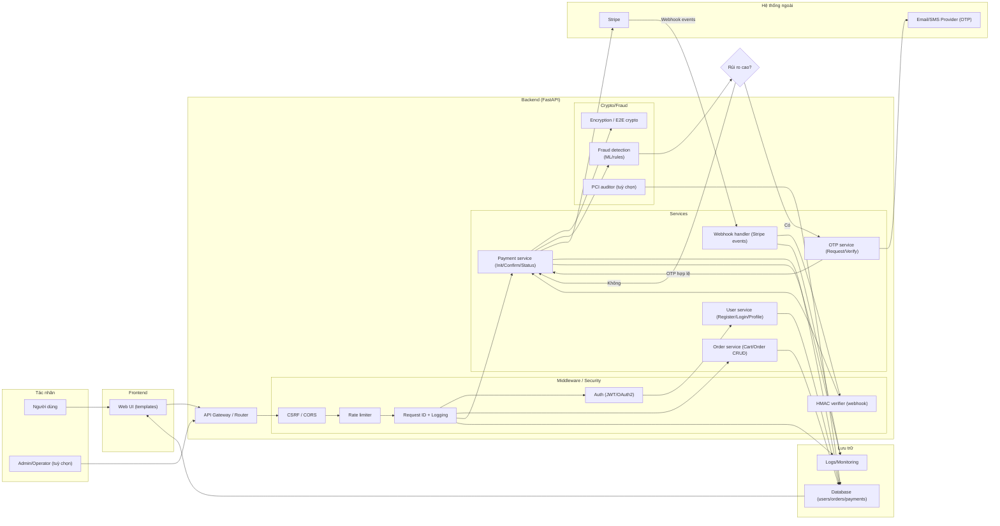
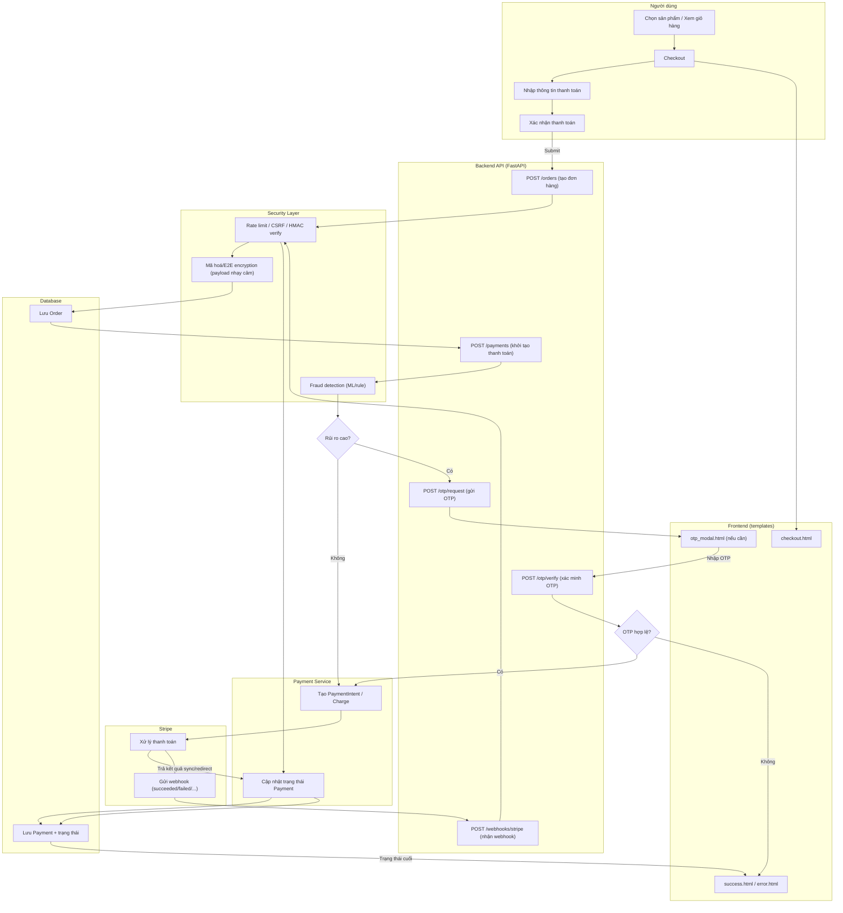

# Sơ đồ luồng hoạt động (tổng quan)

Nếu bạn dùng extension kiểu **Mermaid Preview** (mở trực tiếp file để render), hãy mở các file `.mmd` (chỉ chứa Mermaid) để tránh lỗi lấy cả Markdown header làm Mermaid code:

- [diagrams/activity_overview.mmd](diagrams/activity_overview.mmd)
- [diagrams/payment_gateway_flow.mmd](diagrams/payment_gateway_flow.mmd)

# Sơ đồ luồng hoạt động (Payment Gateway)

Gợi ý: nếu bạn muốn mình vẽ **luồng cụ thể hơn** (ví dụ: chỉ OTP flow, hoặc chỉ webhook flow), nói giúp 1 câu: bạn muốn sơ đồ cho phần nào (Checkout/OTP/Webhook/Auth)?
