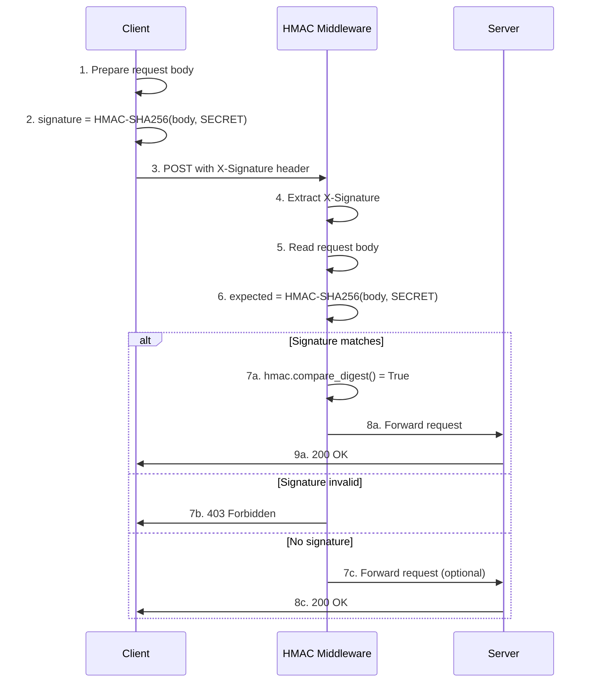

# 🔐 HMAC TRONG ĐỒ ÁN - HƯỚNG DẪN CHI TIẾT

## 📋 TỔNG QUAN

HMAC (Hash-based Message Authentication Code) trong đồ án của bạn được sử dụng để **xác thực tính toàn vẹn** của request giữa client và server, đảm bảo:
- ✅ Request không bị chỉnh sửa (integrity)
- ✅ Request đến từ nguồn tin cậy (authenticity)
- ✅ Chống replay attacks (khi kết hợp với nonce/timestamp)

---

## 🎯 CÁCH HOẠT ĐỘNG

### **Kiến trúc tổng thể**

```
┌──────────────┐                                ┌──────────────┐
│   CLIENT     │                                │    SERVER    │
│  (Browser)   │                                │  (Backend)   │
└──────────────┘                                └──────────────┘
       │                                               │
       │  1. Prepare request body                     │
       │     body = {username: "user", ...}           │
       │                                               │
       │  2. Generate HMAC signature                  │
       │     signature = HMAC-SHA256(body, SECRET)    │
       │                                               │
       │  3. Send request with signature              │
       ├──────────────────────────────────────────────>│
       │     POST /api/payment                        │
       │     Header: X-Signature: abc123...           │
       │     Body: {username: "user", ...}            │
       │                                               │
       │                       4. Extract signature   │
       │                          from header         │
       │                                               │
       │                       5. Re-compute HMAC     │
       │                          expected = HMAC-    │
       │                          SHA256(body, SECRET)│
       │                                               │
       │                       6. Compare signatures  │
       │                          if (signature ==    │
       │                              expected)       │
       │                                               │
       │  7. ✅ Accept request                        │
       │<──────────────────────────────────────────────┤
       │     200 OK                                   │
       │                                               │
```

---

## 🔍 IMPLEMENTATION DETAILS

### **1. Backend - HMAC Verifier Middleware**

📁 File: `backend/middleware/hmac_verifier.py`

```python
SECRET = os.getenv("GATEWAY_HMAC_SECRET", "gateway-secret-key")

class HMACVerifierMiddleware(BaseHTTPMiddleware):
    async def dispatch(self, request: Request, call_next):
        # Bước 1: Lấy signature từ header
        signature = request.headers.get("X-Signature")
        
        # Bước 2: Đọc request body
        body = await request.body()

        # Bước 3: Tính toán expected signature
        expected_sig = hmac.new(
            SECRET.encode(),  # Secret key
            body,             # Message (request body)
            hashlib.sha256    # Hash algorithm
        ).hexdigest()

        # Bước 4: So sánh signatures (timing-safe)
        if signature and hmac.compare_digest(signature, expected_sig):
            return await call_next(request)  # ✅ Valid
        elif not signature:
            return await call_next(request)  # Optional signature
        else:
            return JSONResponse(
                {"detail": "Invalid HMAC signature"},
                status_code=403  # ❌ Invalid
            )
```

### **2. Client - Generate HMAC (JavaScript)**

⚠️ **LƯU Ý**: Hiện tại code frontend (`crypto_utils.js`) **chưa có HMAC implementation**. 

Để client tạo HMAC signature, cần thêm code sau:

```javascript
// Thêm vào crypto_utils.js
class PaymentCryptoUtils {
    // ... existing code ...
    
    /**
     * Generate HMAC-SHA256 signature for request body
     * @param {Object} data - Request body (will be JSON.stringify)
     * @returns {Promise<string>} Hex-encoded HMAC signature
     */
    async generateHMAC(data) {
        // 1. Get secret key from environment or session
        const secretKey = await this.getHMACSecret();
        
        // 2. Convert data to string
        const message = JSON.stringify(data);
        
        // 3. Convert secret and message to ArrayBuffer
        const encoder = new TextEncoder();
        const keyData = encoder.encode(secretKey);
        const messageData = encoder.encode(message);
        
        // 4. Import secret as CryptoKey
        const cryptoKey = await crypto.subtle.importKey(
            'raw',
            keyData,
            { name: 'HMAC', hash: 'SHA-256' },
            false,
            ['sign']
        );
        
        // 5. Generate HMAC signature
        const signature = await crypto.subtle.sign(
            'HMAC',
            cryptoKey,
            messageData
        );
        
        // 6. Convert to hex string
        return this._arrayBufferToHex(signature);
    }
    
    /**
     * Utility: Convert ArrayBuffer to Hex
     */
    _arrayBufferToHex(buffer) {
        return Array.from(new Uint8Array(buffer))
            .map(b => b.toString(16).padStart(2, '0'))
            .join('');
    }
}
```

### **3. Usage Example**

```javascript
// Frontend - Khi gửi request
async function makeSecureRequest(url, data) {
    // Generate HMAC signature
    const signature = await PaymentCrypto.generateHMAC(data);
    
    // Send request with signature
    const response = await fetch(url, {
        method: 'POST',
        headers: {
            'Content-Type': 'application/json',
            'X-Signature': signature  // ← HMAC signature
        },
        body: JSON.stringify(data)
    });
    
    return response.json();
}
```

---

## 🔐 SECRET KEY MANAGEMENT

### **Environment Variable**

```bash
# .env file
GATEWAY_HMAC_SECRET=your-super-secret-key-here-32-bytes-minimum
```

### **Best Practices**

✅ **DO:**
- Sử dụng key >= 32 bytes (256 bits)
- Store trong environment variables
- Rotate key định kỳ (3-6 tháng)
- Sử dụng key khác nhau cho dev/staging/prod

❌ **DON'T:**
- Hard-code secret trong code
- Share secret qua email/chat
- Commit secret vào Git
- Sử dụng weak secret ("password123")

---

## 🛡️ BẢO MẬT & CHỐNG TẤN CÔNG

### **1. Timing-Safe Comparison**

```python
# ❌ KHÔNG AN TOÀN - Timing attack
if signature == expected_sig:
    return True

# ✅ AN TOÀN - Constant-time comparison
if hmac.compare_digest(signature, expected_sig):
    return True
```

**Tại sao?** So sánh string thông thường (`==`) dừng ngay khi gặp ký tự khác nhau → Attacker có thể đo thời gian để brute-force từng byte.

### **2. HTTPS Enforcement**

```python
# Optional: Chỉ chấp nhận HMAC qua HTTPS
ENFORCE_TLS = os.getenv("ENFORCE_TLS", "false").lower() == "true"

if ENFORCE_TLS and signature and request.url.scheme != "https":
    return JSONResponse(
        {"detail": "HMAC-signed requests must use HTTPS"},
        status_code=403
    )
```

### **3. Chống Replay Attacks**

Thêm timestamp/nonce vào request body:

```javascript
const data = {
    username: "user123",
    amount: 1000,
    nonce: crypto.randomUUID(),           // Random nonce
    timestamp: Date.now()                  // Current timestamp
};

const signature = await generateHMAC(data);
```

Backend kiểm tra:
```python
# Chỉ chấp nhận request trong 5 phút
MAX_AGE = 300  # seconds
if time.time() - request_timestamp > MAX_AGE:
    raise HTTPException(403, "Request expired")

# Kiểm tra nonce đã được sử dụng chưa
if is_nonce_used(nonce):
    raise HTTPException(403, "Duplicate request")
```

---

## 📊 FLOW CHART CHI TIẾT



---

## ⚙️ CONFIGURATION

### **Middleware Registration**

📁 File: `backend/main.py`

```python
from backend.middleware.hmac_verifier import HMACVerifierMiddleware

app = FastAPI()

# Setup middleware
app.add_middleware(HMACVerifierMiddleware)  # ← HMAC verification
app.add_middleware(RateLimitMiddleware)
app.add_middleware(RequestIDMiddleware)
```

### **Environment Variables**

```bash
# Required
GATEWAY_HMAC_SECRET=your-secret-key-here

# Optional
ENFORCE_TLS=true              # Force HTTPS for signed requests
```

---

## 🧪 TESTING

### **Test với curl**

```bash
# 1. Generate HMAC signature (Python)
echo -n '{"username":"test"}' | \
  openssl dgst -sha256 -hmac "gateway-secret-key" | \
  awk '{print $2}'

# Output: abc123def456...

# 2. Send request with signature
curl -X POST http://localhost:8000/api/endpoint \
  -H "Content-Type: application/json" \
  -H "X-Signature: abc123def456..." \
  -d '{"username":"test"}'
```

### **Test Script**

```python
import hmac
import hashlib
import requests

SECRET = "gateway-secret-key"
URL = "http://localhost:8000/api/payment"

# Prepare data
data = '{"username":"test","amount":1000}'

# Generate signature
signature = hmac.new(
    SECRET.encode(),
    data.encode(),
    hashlib.sha256
).hexdigest()

# Send request
response = requests.post(
    URL,
    headers={
        "Content-Type": "application/json",
        "X-Signature": signature
    },
    data=data
)

print(f"Status: {response.status_code}")
print(f"Response: {response.json()}")
```

---

## ❓ FAQ

### **Q: Khi nào cần HMAC signature?**

A: Hiện tại middleware cho phép request **không có** signature (optional). Có thể config strict mode:

```python
# Bắt buộc signature cho mọi POST/PUT/DELETE
if request.method in ["POST", "PUT", "DELETE"] and not signature:
    return JSONResponse(
        {"detail": "X-Signature header required"},
        status_code=403
    )
```

### **Q: HMAC khác JWT như thế nào?**

| Feature | HMAC | JWT |
|---------|------|-----|
| Purpose | Verify integrity | Authentication + data |
| Stateless | No (need shared secret) | Yes (self-contained) |
| Expiration | No (add manually) | Yes (exp claim) |
| Data | Only signature | Header + Payload + Signature |

### **Q: Có thể dùng HMAC cho authentication không?**

A: **Không nên**. HMAC chỉ verify integrity, không chứa user info. Sử dụng JWT/OAuth2 cho authentication.

### **Q: Secret key bị lộ thì sao?**

A: 
1. Rotate secret ngay lập tức
2. Invalidate tất cả signed requests cũ
3. Investigate security breach
4. Update secret trên tất cả services

---

## 📝 CHECKLIST IMPLEMENTATION

### Client-side (Frontend)
- [ ] Implement `generateHMAC()` function
- [ ] Add X-Signature header to requests
- [ ] Handle 403 errors gracefully
- [ ] Add timestamp/nonce for replay protection

### Server-side (Backend)
- [x] HMAC middleware implemented
- [x] Timing-safe comparison
- [x] Optional signature support
- [ ] Add nonce/timestamp validation
- [ ] Add strict mode for critical endpoints
- [ ] Log failed verification attempts

### Security
- [ ] Generate strong SECRET key (32+ bytes)
- [ ] Store in environment variables
- [ ] Enable ENFORCE_TLS in production
- [ ] Setup key rotation schedule
- [ ] Document secret rotation procedure

---

## 🚀 NEXT STEPS

1. **Thêm HMAC generation vào frontend** (crypto_utils.js)
2. **Test với Postman/curl** để verify hoạt động
3. **Enable strict mode** cho critical endpoints
4. **Add replay protection** (nonce + timestamp)
5. **Setup monitoring** cho failed HMAC attempts

---

**Tài liệu tạo**: December 22, 2025  
**Version**: 1.0  
**Author**: NT219 Capstone Project
