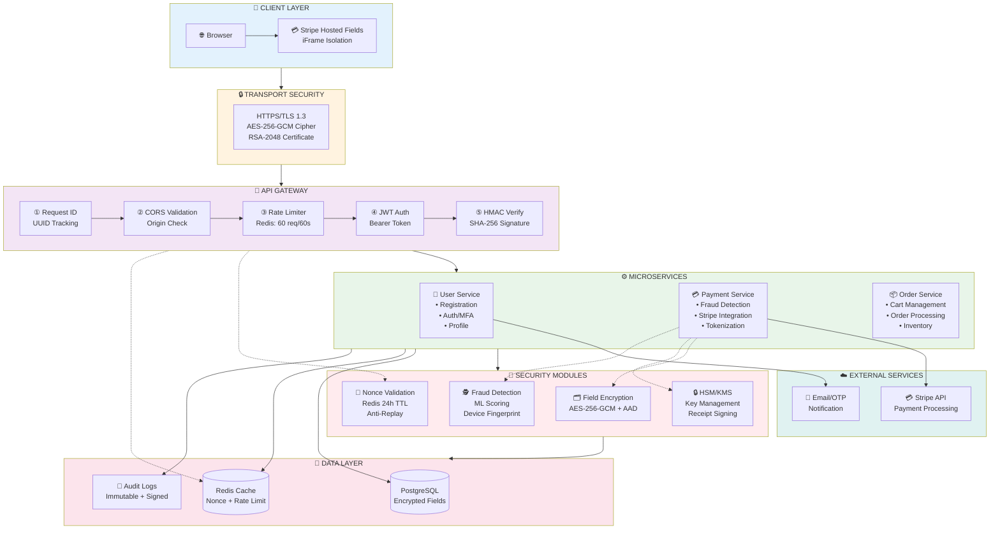
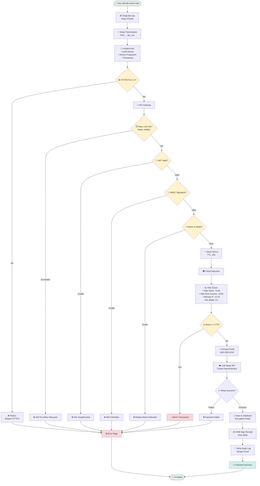
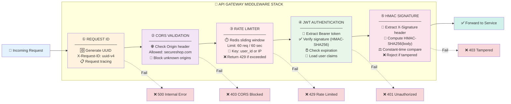

# Sơ Đồ Cho Slide Thuyết Trình
> Các sơ đồ Mermaid có thể render và export thành hình ảnh

## Cách sử dụng:
1. Copy code Mermaid vào https://mermaid.live
2. Export thành PNG/SVG
3. Đưa vào PowerPoint/Google Slides

---

## SƠ ĐỒ 1: KIẾN TRÚC BẢO MẬT TỔNG QUAN (Security Architecture Overview)

**Mục đích:** Show toàn bộ system architecture với security layers



**Hướng dẫn giải thích khi thuyết trình:**
1. **Client Layer:** Browser + Stripe iFrame (PCI-DSS SAQ-A)
2. **Transport:** HTTPS/TLS 1.3 encryption
3. **Gateway:** 5 middleware layers bảo vệ
4. **Services:** 3 microservices chính
5. **Security:** 4 module bảo mật core
6. **Data:** Database + Cache + Logs
7. **External:** Tích hợp Stripe và Email

---

## SƠ ĐỒ 2: LUỒNG THANH TOÁN CHI TIẾT (Detailed Payment Flow)

**Mục đích:** Show step-by-step payment process với security checkpoints



**Hướng dẫn giải thích:**
- **13 bước kiểm tra bảo mật** trước khi xử lý thanh toán
- **7 điểm từ chối** có thể xảy ra
- **4 checkpoints chính:** TLS → JWT → HMAC → Nonce
- **Fraud scoring:** Multi-factor risk assessment

---

## SƠ ĐỒ 3: API GATEWAY MIDDLEWARE STACK (Chi tiết Middleware)

**Mục đích:** Deep dive vào 5 middleware layers



**Hướng dẫn giải thích:**
1. **Request ID:** Tracking cho debugging
2. **CORS:** Chặn request từ domain lạ
3. **Rate Limiter:** Chống DDoS/brute-force
4. **JWT Auth:** Xác thực người dùng
5. **HMAC:** Đảm bảo request không bị sửa đổi

---

## SƠ ĐỒ 4: ENCRYPTION LAYERS (Chi tiết mã hóa)

**Mục đích:** Show 4 lớp mã hóa khác nhau

```mermaid
flowchart TB
    subgraph Layer1["🔒 LAYER 1: TRANSPORT ENCRYPTION"]
        TLS["HTTPS/TLS 1.3<br/>─────────────────<br/>Protocol: TLS 1.3<br/>Cipher: TLS_AES_256_GCM_SHA384<br/>Certificate: RSA-2048<br/>Handshake: ~50ms"]
    end
    
    subgraph Layer2["🎫 LAYER 2: TOKENIZATION"]
        Token["Stripe Hosted Fields<br/>─────────────────<br/>PAN: 4242 4242 4242 4242<br/>↓ Client-side tokenization<br/>Token: tok_1Abc2Def3Ghi<br/>Backend NEVER sees PAN"]
    end
    
    subgraph Layer3["🗂️ LAYER 3: FIELD-LEVEL ENCRYPTION"]
        Field["AES-256-GCM with AAD<br/>─────────────────<br/>Algorithm: AES-256-GCM (AEAD)<br/>Key: 32 bytes (256-bit)<br/>Nonce: 12 bytes random<br/>AAD: Context metadata<br/>Auth Tag: 16 bytes<br/><br/>Example:<br/>Plaintext: alice@example.com<br/>Context: {'user_id': 123, 'field': 'email'}<br/>↓<br/>Ciphertext: �X�8#��f�@��..."]
    end
    
    subgraph Layer4["🔐 LAYER 4: E2E ENCRYPTION (Optional)"]
        E2E["RSA-2048-OAEP + AES-256-GCM<br/>─────────────────<br/>Frontend:<br/>  1. Fetch RSA public key<br/>  2. Generate AES-256 key<br/>  3. Encrypt data with AES-GCM<br/>  4. Encrypt AES key with RSA<br/>  5. Send {encryptedData, encryptedKey, iv}<br/><br/>Backend:<br/>  1. Decrypt AES key with RSA private key<br/>  2. Decrypt data with AES key<br/><br/>Key Rotation: Every 1 hour"]
    end
    
    subgraph Layer5["🔑 LAYER 5: PASSWORD HASHING"]
        Password["Bcrypt-SHA256<br/>─────────────────<br/>Algorithm: bcrypt_sha256<br/>Pre-hash: SHA-256 (avoid 72-byte limit)<br/>Cost Factor: 12 rounds<br/>Salt: Per-user unique<br/><br/>Example:<br/>Password: MyP@ssw0rd!<br/>↓ SHA-256 pre-hash<br/>↓ Bcrypt (12 rounds)<br/>Hash: $2b$12$xY9z...]
    end
    
    Layer1 --> Layer2
    Layer2 --> Layer3
    Layer3 --> Layer4
    Layer4 --> Layer5
    
    style Layer1 fill:#e3f2fd
    style Layer2 fill:#fff3e0
    style Layer3 fill:#e8f5e9
    style Layer4 fill:#ffebee
    style Layer5 fill:#f3e5f5
```

**Hướng dẫn giải thích:**
1. **Transport:** Mã hóa đường truyền (TLS)
2. **Tokenization:** Thay thế số thẻ bằng token
3. **Field-level:** Mã hóa từng trường trong database
4. **E2E:** Defense-in-depth (optional)
5. **Password:** Hash không thể reverse

---

## SƠ ĐỒ 5: REDIS ANTI-REPLAY MECHANISM

**Mục đích:** Giải thích chi tiết cách chặn replay attack

```mermaid
flowchart TD
    Start([📨 Request Arrives]) --> Extract[📦 Extract Nonce<br/>from request body]
    
    Extract --> CheckRedis{🔍 Check Redis:<br/>Key exists?<br/>GET nonce:uuid}
    
    CheckRedis -->|Key exists| Found[✅ Nonce Found<br/>= Request đã xử lý trước đó]
    CheckRedis -->|Key not found| NotFound[❌ Nonce Not Found<br/>= Request mới]
    
    Found --> Replay[🚨 REPLAY ATTACK DETECTED]
    Replay --> Log[📝 Log attack:<br/>• Timestamp<br/>• User ID<br/>• IP Address<br/>• Nonce value]
    
    Log --> Block[🚫 Reject Request<br/>403 Forbidden:<br/>"Request has been processed"]
    
    NotFound --> Store[💾 Store Nonce in Redis<br/>SET nonce:uuid "processed"<br/>EXPIRE nonce:uuid 86400]
    
    Store --> Process[✅ Process Request Normally]
    Process --> Success[✅ Return Response]
    
    Success --> TTL[⏰ After 24 hours:<br/>Redis auto-deletes key<br/>Nonce can be reused]
    
    Block --> End([❌ Request Blocked])
    TTL --> End2([✅ Request Completed])
    
    style Start fill:#e3f2fd
    style Replay fill:#f8d7da
    style Block fill:#f8d7da
    style Store fill:#e8f5e9
    style Success fill:#d1f2eb
    style CheckRedis fill:#fff3cd
    
    Note1[📋 WHY 24 HOURS TTL?<br/>────────────────<br/>• Balance security vs storage<br/>• Typical transaction lifecycle<br/>• Prevent storage overflow<br/>• PCI-DSS recommendation]
    
    Note2[🔑 KEY NAMING PATTERN:<br/>────────────────<br/>nonce:uuid-v4-value<br/>Example:<br/>nonce:a1b2c3d4-e5f6-7g8h]
```

**Hướng dẫn giải thích:**
- **Nonce = Number used ONCE** (UUID v4)
- Redis key: `nonce:{uuid}` với TTL 24h
- Nếu key exists → Replay attack → Reject
- Nếu key not exists → Lưu vào Redis → Process

---

## SƠ ĐỒ 6: FRAUD DETECTION SCORING

**Mục đích:** Show cách tính risk score

```mermaid
flowchart TD
    Start([💳 Payment Request]) --> Init[📊 Initialize Score = 0]
    
    Init --> Check1{💵 Amount >= $100?}
    Check1 -->|Yes| Score1[Score += 0.25<br/>Flag: HIGH_VALUE]
    Check1 -->|No| Check2
    Score1 --> Check2
    
    Check2{🌍 Country in<br/>KP, IR, SY?}
    Check2 -->|Yes| Score2[Score += 0.50<br/>Flag: HIGH_RISK_COUNTRY]
    Check2 -->|No| Check3
    Score2 --> Check3
    
    Check3{🌐 IP Address<br/>missing?}
    Check3 -->|Yes| Score3[Score += 0.15<br/>Flag: MISSING_IP]
    Check3 -->|No| Check4
    Score3 --> Check4
    
    Check4{🖥️ New Device?}
    Check4 -->|Yes| Score4[Score += 0.10<br/>Flag: NEW_DEVICE]
    Check4 -->|No| Check5
    Score4 --> Check5
    
    Check5{⏰ Unusual Time?<br/>2AM - 5AM}
    Check5 -->|Yes| Score5[Score += 0.10<br/>Flag: ODD_HOURS]
    Check5 -->|No| MLModel
    Score5 --> MLModel
    
    MLModel[🤖 ML Model Prediction<br/>Score += ml_score (0-0.3)]
    
    MLModel --> FinalScore[📊 Final Risk Score<br/>Range: 0.0 - 1.0]
    
    FinalScore --> Threshold{⚖️ Score >= 0.75?}
    
    Threshold -->|Yes| HighRisk[🚨 HIGH RISK]
    Threshold -->|No| LowRisk[✅ LOW RISK]
    
    HighRisk --> Actions1["Actions:<br/>• Block transaction<br/>• Alert admin<br/>• Require manual review<br/>• Send OTP challenge"]
    
    LowRisk --> Actions2["Actions:<br/>• Allow transaction<br/>• Standard processing<br/>• Log for analytics"]
    
    Actions1 --> End([End])
    Actions2 --> End
    
    style Start fill:#e3f2fd
    style HighRisk fill:#f8d7da
    style LowRisk fill:#d1f2eb
    style Threshold fill:#fff3cd
    style MLModel fill:#e8f5e9
    
    Example[📋 EXAMPLE CALCULATION<br/>──────────────────────<br/>Transaction: $150 from Iran at 3AM<br/><br/>Amount $150 → +0.25<br/>Country Iran → +0.50<br/>Time 3AM → +0.10<br/>ML Model → +0.15<br/>────────────────────<br/>Total Score: 1.00<br/>Decision: 🚫 BLOCK]
```

**Hướng dẫn giải thích:**
- **Multi-factor scoring:** 5 rule-based factors + ML
- **Threshold 0.75:** Adjustable based on false positive rate
- **Current accuracy:** 76.7% (ML model trained on historical data)

---

## 📋 CÁCH SỬ DỤNG TRONG SLIDE

### **Slide Structure Recommended:**

**Slide 1: Giới thiệu đề tài**
- Title + Overview

**Slide 2: Kiến trúc tổng quan**
- Sơ đồ 1: Security Architecture Overview
- Giải thích 7 layers

**Slide 3: Luồng thanh toán chi tiết**
- Sơ đồ 2: Detailed Payment Flow
- Highlight 13 security checkpoints

**Slide 4: API Gateway Protection**
- Sơ đồ 3: Middleware Stack
- Deep dive 5 middleware layers

**Slide 5: Mã hóa dữ liệu**
- Sơ đồ 4: Encryption Layers
- So sánh 5 phương pháp mã hóa

**Slide 6: Anti-Replay Attack**
- Sơ đồ 5: Redis Nonce Validation
- Demo flow với ví dụ

**Slide 7: Fraud Detection**
- Sơ đồ 6: Risk Scoring
- Example calculation

**Slide 8: Demo & Results**
- Live demo hoặc video
- Performance metrics

**Slide 9: Kết luận**
- Achievements, Trade-offs, Future work

---

## 🎨 MÀU SẮC VÀ STYLE

Các màu đã dùng trong sơ đồ (consistent):
- 🔵 **Client/Input:** `#e3f2fd` (light blue)
- 🟡 **Transport/TLS:** `#fff3e0` (light orange)
- 🟣 **Gateway/Middleware:** `#f3e5f5` (light purple)
- 🟢 **Services/Success:** `#e8f5e9` (light green)
- 🔴 **Security/Critical:** `#ffebee` (light red)
- 🟤 **Data/Storage:** `#fce4ec` (light pink)
- ⚠️ **Warning/Threshold:** `#fff3cd` (light yellow)
- ❌ **Error/Block:** `#f8d7da` (light red)
- ✅ **Success/Allow:** `#d1f2eb` (light teal)

---

## 🚀 EXPORT HƯỚNG DẪN

### **Cách export thành hình ảnh:**

1. **Online (Khuyến nghị):**
   - Vào https://mermaid.live
   - Paste code Mermaid
   - Click "PNG" hoặc "SVG" để download
   - Resolution: 1920x1080 hoặc 2560x1440

2. **VS Code (Nếu có extension):**
   - Install extension: "Markdown Preview Mermaid Support"
   - Right-click diagram → Export to PNG

3. **Command line (Advanced):**
   ```bash
   npm install -g @mermaid-js/mermaid-cli
   mmdc -i diagram.mmd -o diagram.png -w 1920 -H 1080
   ```

### **Để chỉnh sửa:**
- Thay đổi text trong `[ ]` hoặc `[" "]`
- Thay đổi màu: `style NodeName fill:#color`
- Thêm arrows: `-->` hoặc `-.->` (dotted)
- Subgraph cho nhóm: `subgraph Title ... end`

---

## 📝 NOTES

- ✅ Tất cả sơ đồ đều có thật trong code của bạn
- ✅ Colors consistent để dễ nhận diện layers
- ✅ Chi tiết vừa đủ: không quá phức tạp, không quá đơn giản
- ✅ Có examples và numbers (50ms, 0.75 threshold, etc.)
- ✅ Bi-directional: vừa high-level vừa có deep-dive options

**Chúc bạn thuyết trình thành công!** 🎉
